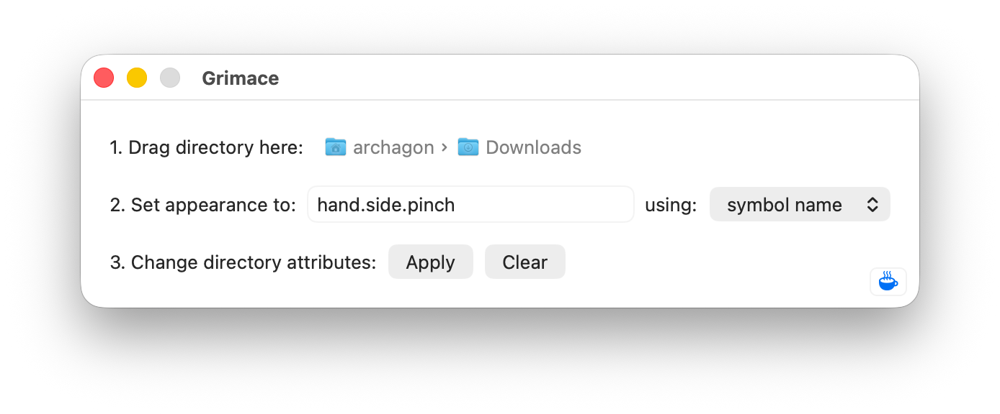

#  Grimace

In macOS Tahoe, you can now customize directories to display an SF Symbol or emoji. Using a shell invocation, this can be extended to private SF Symbols and arbitrary text strings: <https://mjtsai.com/blog/2025/07/11/macos-tahoes-folder-icon-customization>

Grimace makes it more convenient to perform this customization. No need to fiddle with `xattr` in the Terminal: just drag in your directory, enter the symbol name or text string, and click Apply.

For a list of private SF Symbols you can use, Quentin Fasquel built a really nice viewer: <https://medium.com/@quentinfasquel/exploring-private-sf-symbols-8b0d064e9032>

Enjoy!

